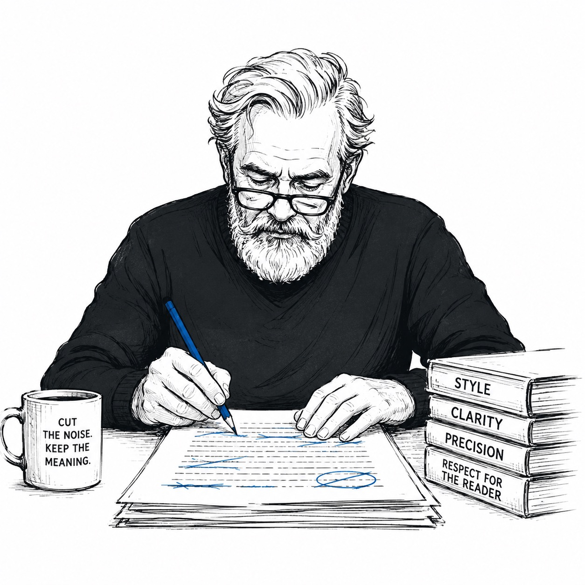

<div align="center">



# Blue Pencil

**Cut the noise. Keep the meaning.**

Forces the clearest, shortest nonfiction prose that survives a tired reader.

</div>

---

Blue Pencil is the greybeard at the desk with the blue pencil, and it's 11pm — the hour every document lands and every reader is spent. It **drafts like an editor and reads like the tired reader you're writing for.** The reader's attention is the scarce resource; the best sentence is the one they never reread.

It works on any nonfiction meant to be read — papers, docs, specs, PRDs, memos, reports, proposals, posts, real emails — for drafting, revising, or reviewing. Not for code, fiction, or throwaway chat.

## The seven principles

The whole craft, applied recursively at every scale — document, section, paragraph, sentence.

1. **Lead with the point, at every scale.** Put the payload where the reader looks for it — the front.
2. **Old before new; context before detail.** Begin each unit with what the reader has, end on what's new. That chain is what makes prose flow.
3. **One idea per unit.** One sentence, one point; one paragraph, one topic; one document, one thesis.
4. **Every claim carries its support and its limits.** A claim with neither evidence nor scope is a hope, not a finding.
5. **Show, don't assert — a number over an adjective.** "3.2-fold," not "substantially." "p95 < 500 ms," not "fast."
6. **Match certainty to the reader's need for a decision.** Keep the hedge that marks real uncertainty; cut reflexive defensive hedging in decisive genres.
7. **Respect load-bearing structure.** Never cut a Non-Goals section, required heading, normative keyword, or acceptance criterion as "throat-clearing."

## The ladder

Pre-emptive — it governs what you choose to write, not only what you cut. For each sentence, stop at the first rung that holds:

1. **Does this sentence need to exist?** Throat-clearing, meta-commentary, restating the obvious → don't write it.
2. **Does the rest of the document back it?** A capability or claim named with no method, milestone, or follow-through → cut it or back it. Ambition is fine; a promise with no path is the defect.
3. **Already said elsewhere?** Merge or cut.
4. **Can the point live in the main clause?** Subject → verb → result. Never bury the news in a subordinate clause.
5. **Plain word available?** Use it — unless the jargon is the field's precise term of art.
6. **One idea, and a number over an adjective.** Split the second idea out; replace the adjective with the measurement.
7. **Only then:** keep the sentence, in its minimal faithful form.

> A confusing paragraph is a structure problem, not a word problem — check the order before polishing sentences in a broken order.

## Modes

| Mode | What it does |
|------|--------------|
| **writing** (default) | Draft or revise prose. The prose first, then ≤3 short notes only if a choice was non-obvious. |
| **review** | Mark up prose for what to cut — anything from a diff to a whole folder. One line per finding (location, what, replacement); no rewrite. Over a document it also flags structure and unearned claims — a buried thesis, a claim repeated across sections, a promise the document never keeps — and ranks the cuts biggest first. Ends on `net: -<N> words possible`, or `Nothing to cut, nothing unbacked. Leave it as written.` |

## Intensity

Primarily tunes *writing* aggressiveness; review always finds everything.

| Level | What changes |
|-------|--------------|
| **lite** | Don't rewrite — name the tighter alternative in one line. Author picks. |
| **full** (default) | The ladder enforced. Shortest faithful version. |
| **ultra** | Structural surgery. Challenge whether paragraphs and sections need to exist; state the achievable word cut and deliver it. |

## Usage

Blue Pencil is active on every response once loaded. Defaults: **writing** mode, **full** intensity.

```
/bluepencil writing|review           # switch mode
/bluepencil lite|full|ultra          # switch intensity
```

Ask it to tighten a paragraph, review a diff, or a whole doc or folder — or just say "bluepencil", "tighten", "make it concise", "too wordy", "clarity pass", "review this doc", or "audit this doc". Turn it off with `stop bluepencil` or `normal mode`.

Mark deliberate deferrals with a `bluepencil:` comment in the source (`% bluepencil: citation needed`) — visible intent, not silent debt.

## When it won't cut

- **Never trade meaning for brevity.** A shorter sentence that claims more or less than the original is an error, not an edit.
- **Certainty is content.** Load-bearing hedges — statistical qualifiers, stated limitations, scope conditions — stay.
- **Numbers, citations, quoted text, and technical claims** are never altered.
- **Load-bearing structural tokens** — normative keywords (MUST / SHOULD / MAY), required headings, acceptance criteria — are untouchable.
- **Never simplify below the audience.** Keep the field's terms of art; fix density with shorter sentences, not lay paraphrase.
- **Venue conventions win.** Journal-mandated passive-voice methods, funder boilerplate, and word limits stay exactly as required.
- **Author insists on the long version** → keep it, no re-arguing.

## Install

```bash
npx skills add tvh/bluepencil
```

## Layout

```
skills/bluepencil/
  SKILL.md     # persona, seven principles, ladder, rules, writing mode
  review.md    # review mode — line + structural findings, diff to folder-wide
```

## Credits

Structure and design modeled on [ponytail](https://github.com/DietrichGebert/ponytail) — it does for over-engineered code what Blue Pencil does for over-written prose.

## License

[MIT](LICENSE)
